МИНИСТЕРСТВО НАУКИ  И ВЫСШЕГО ОБРАЗОВАНИЯ РОССИЙСКОЙ ФЕДЕРАЦИИ  

Федеральное государственное автономное образовательное учреждение высшего образования  

"КРЫМСКИЙ ФЕДЕРАЛЬНЫЙ УНИВЕРСИТЕТ им. В. И. ВЕРНАДСКОГО"  

ФИЗИКО-ТЕХНИЧЕСКИЙ ИНСТИТУТ  

Кафедра компьютерной инженерии и моделирования
<br/><br/>
### Отчёт по лабораторной работе № 1<br/> по дисциплине "Программирование"
<br/>
​Cтудента 1 курса группы ПИ-б-о-192(1)<br/>
Гусько Елизавета Викторовна<br/>
направления подготовки 09.03.04 "Программная инженерия"  
<br/>


<br/>
<table>

<tr><td>Научный руководитель<br/> старший преподаватель кафедры<br/> компьютерной инженерии и моделирования</td>

<td>(оценка)</td>

<td>Чабанов В.В.</td>

</tr>

</table>

<br/><br/>

​

Симферополь, 2019

<br/>

# Лабораторная работа №7

# Изучение базовых возможностей IDE Qt Creator

### ***Цель***: изучить основные возможности создания и отладки программ в IDE Qt Creator.

#### 1.Как создать консольное приложение С++ в IDE Qt Creator без использования компонентов Qt.<br/>
1. Запускаем приложение QT Creator.  
 Необходимо открыть QT Creator, затем:<br>
  **Проекты → Создать → Проект без QT → Приложение на языке с++.** <br/> 
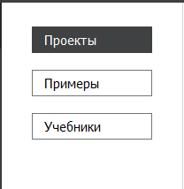 <br>
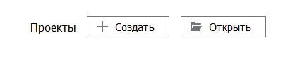 <br>
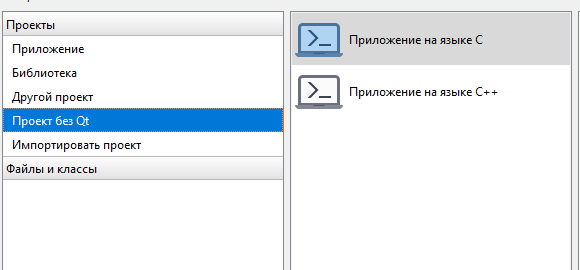
>рис.1 создание консольного приложения c++ в qt

#### 2.Как изменить цветовую схему (оформление) среды.<br/>
Необходимо нажать на меню **Инструменты → Параметры → Среда**, после чего выбирать темы.<br>
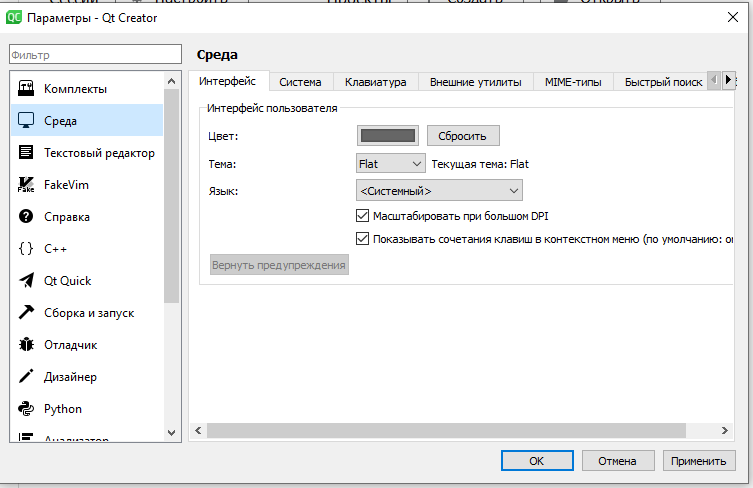 <br>
>рис.4 цветовые схемы
 #### 3.Как закомментировать/раскомментировать блок кода средствами QT Creator. <br/>
 С помощью сочетания клавиш **CTRL + /** <br/> 
 #### 4. Как открыть в проводнике Windows папку с проектом средствами QT Creator.<br/>
Необходимо нажать на любой файл в проекте правой кнопкой мыши → показать в проводнике.<br>
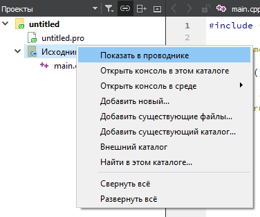 <br>
>рис.5 открытие папки с проектом
 #### 5. Какое расширение файла-проекта используется QT Creator.
***.pro***<br>
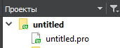 <br>
>рис.6 расширение файла-проекта
 #### 6. Как запустить код без отладки.
Комбинация клавиш ***CTRL + R*** или знак зелёной стрелочки.<br/>
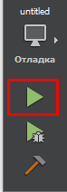 <br>
>рис.7 запуск без отладки
 #### 7. Как запустить код в режиме отладки
Клавиша ***F5*** или стрелочка с жуком <br>
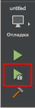 <br>
>рис.8 запуск проекта с отладкой
 #### 8. Как установить/убрать точку останова (breakpoint).
Клавиша ***F9*** <br/> либо ПКМ по серому полю нужно строки. <br>
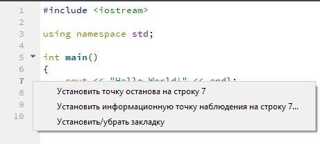 <br>
>рис.9 точка останова
 #### 9. Создайте программу со следующим кодом:

```c++
#include <iostream>

int main() {
    int i;
    double d;
    i = 5;
    d = 5;
    std::cout << i << d;
    return 0;
}
```
* Переключитесь в конфигурацию сборки "Отладка"; <br>
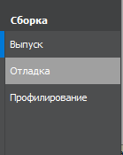 <br>
>рис.10 "Отладка"
* Установите breakpoint на 5, 6 и 7 строках; <br>
* Запустите приложение щелкнув по кнопке с изображением жука; <br>
* Используйте эту же кнопку для перехода к следующей точке останова; <br>
* Какое значение содержит переменная i в 5й строке? <br>
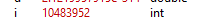
>рис.11 значение i
* Какое значение содержит переменная d в 6й строке? <br>
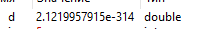
>рис.12 значение d
* Какие значение содержатся в переменных i и  d в 7й строке? <br>
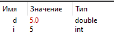
>рис.13 значения i и d
* Совпадают ли эти значения с теми, что вы получали в MSVS для соответствующих типов? Да.<br>
#### 10. Выбираем проект «Calculator Form Example». 
#### 11. В инспекторе проекта выбираем файл «main.cpp». В этом файле устанавливаем курсор на слово «show» в строке calculator.show(); и нажимаем **F1**. <br>
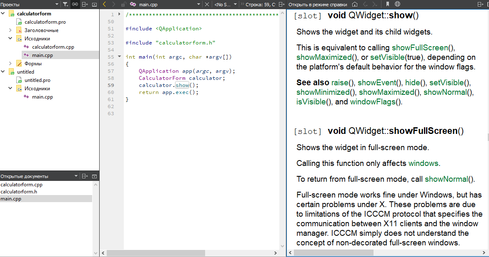
>рис.15 справка
#### 12. Через файл «calculatorform.ui» мы попадаем во вкладку "Дизайн".
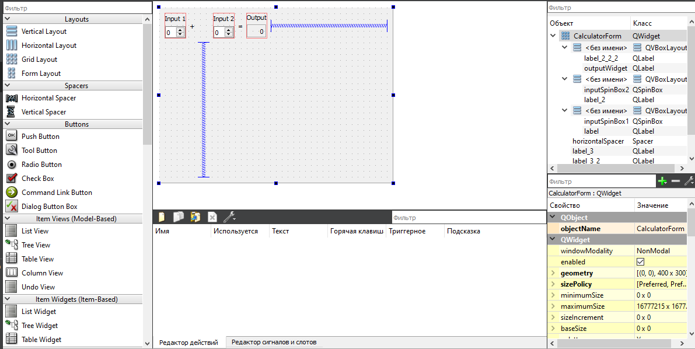 
>рис.16 дизайн 
Заменим текст на русский и пересобирем проект.
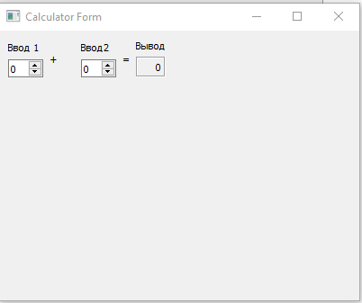 
>рис.17 сборка
###  Вывод: я изучила основные возможности создания и отладки программ в IDE Qt Creator.
